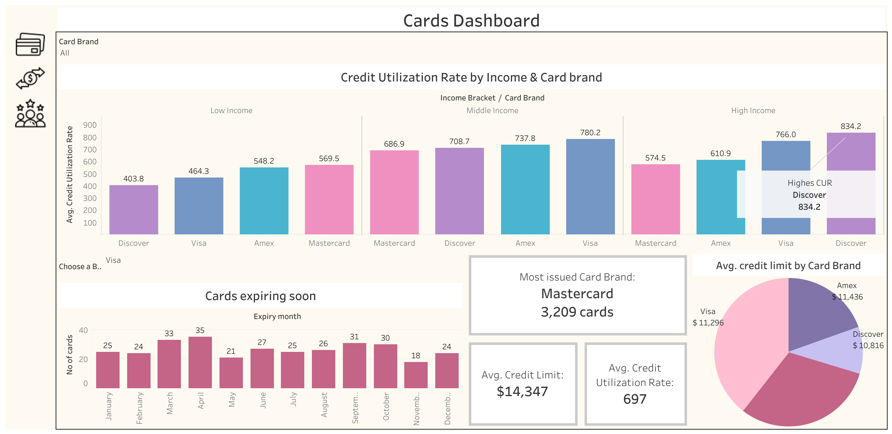
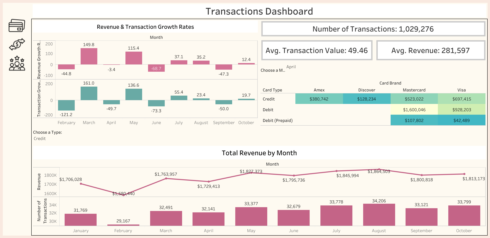
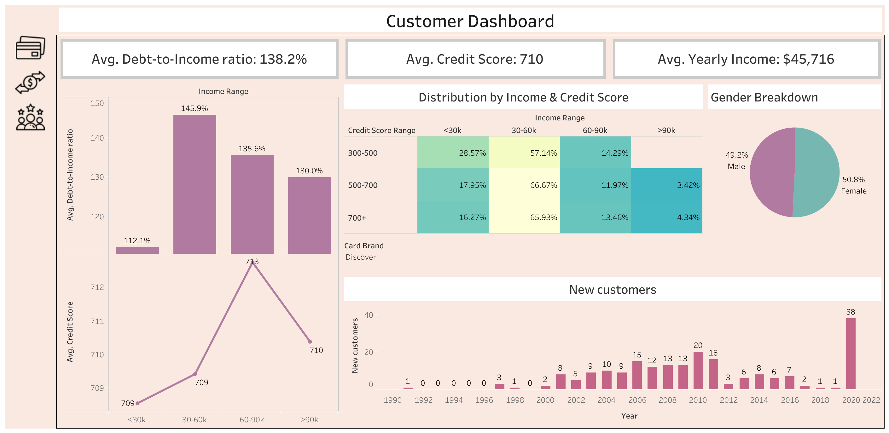

# CardMetrics

# Project Background:

The company CardMetrics Inc. operates in the financial services industry, specializing in credit card issuance and payment processing. It employs a hybrid B2C and B2B model, serving individual customers and corporate clients with tailored credit solutions. The company generates revenue through a subscription-based and transactional model, earning from interest on revolving credit, processing fees, and customer engagement programs.

Key business metrics include credit utilization rates (CUR), transaction volume trends, customer retention, and revenue growth. These metrics enable the company to evaluate card performance, customer financial health, and market competitiveness.

The analysis was presented in three interactive dashboards tailored for stakeholders to gain insights into performance and identify growth opportunities:
1. Cards Dashboard: Focuses on credit card performance, including CUR trends by income and card brand, expiring card monitoring, and segmentation of credit limits.
2. Transactions Dashboard: Highlights revenue and transactional growth, comparing performance by month, card type, and card brand, with visual insights into revenue generation and customer spending patterns.
3. Customer Dashboard: Examines customer demographics and financial health metrics, including debt-to-income ratios, credit score distributions, income levels, and gender-based breakdowns, while tracking new customer acquisition trends.

Insights and recommendations are provided on the following key areas:

- Revenue and Transactions growth
- Product performance and engagement
- Customer demographics and financial health
- Credit utilization and limit trends
- Insights into customer retention and card expiration

# Data Structure & Initial Checks

### Data cleaning:

Before importing the dataset into MySQL Workbench, I performed the following data cleaning steps:
- Removed the "$" sign from columns like per_capita_income and yearly_income to ensure numerical consistency.
- Formatted date columns into the correct format for proper storage and querying.
- Dropped irrelevant columns such as card_on_dark_web to maintain dataset relevance.
- Imputed "0" in ZIP records where transactions were conducted online.
- Replaced empty values in the errors column with NULL to maintain data integrity.
  
The company’s main database consists of three primary tables:
1. Users_data – Stores customer demographic and financial information, including age, gender, income, debt, and credit scores.
2. Cards_data – Contains details of issued credit cards, such as card brand, type, credit limit, expiration date, and security features.
3. Transactions_data – Records transaction history, including amounts, merchant details, and payment methods (chip usage, location).
Each table is linked via client_id, allowing cross-analysis of customer demographics, spending behavior, and credit health metrics.

The SQL code used to create tables, establish relationships can be found [here](initial_sql.sql).

The SQL code used to manipulate the data can be found 

# Executive Summary

Higher-income groups (>90k) manage debt more effectively, maintaining a lower debt-to-income ratio (130%), while the 30-60k income range has the highest ratio (145.9%). Despite this, high-credit-score individuals (700+) are more concentrated in lower-income groups (<30k and 30-60k). Visa leads in total revenue, generating $6,97,415 from credit transactions and $9,28,203 from debit, while seasonal trends show March as the strongest month for revenue growth (149.8) and transactions (161.0), contrasting with a sharp decline in June (-68.7 revenue, -73.3 transactions).

# Insights deep dive

### Revenue and Transactions Growth

•	March saw the highest revenue growth (149.8) and transaction growth (161.0), indicating strong performance.
•	June experienced a significant drop in revenue (-68.7) and transactions (-73.3), suggesting seasonal fluctuations or external factors affecting spending.
•	The average transaction value is 49.46, with an average revenue of 281,597, providing a benchmark for monthly performance.

### Product Performance and Engagement
•	Visa has the highest total revenue contribution across both credit ($6,97,415) and debit ($9,28,203) transactions, indicating strong customer preference.
•	Mastercard and Amex have significant engagement in the credit category, with $5,23,022 and $3,80,742 in revenue, respectively.
•	Prepaid debit transactions contribute minimally ($42,489 for Visa), suggesting lower engagement with this product.

### Customer Demographics and Financial Health
•	The average credit score is 710, with the 60-90k income group having the highest average (713).
•	The lowest credit score (709) is in both the 30-60k and <30k income groups.
•	Gender distribution is nearly equal, with 50.8% female and 49.2% male customers.

### Credit Utilization and Limit Trends
•	The average debt-to-income ratio is 138.2%, with the highest ratio (145.9%) observed in the 30-60k income range.
•	Higher-income groups (>90k) have a lower debt-to-income ratio (130%), suggesting better financial management.
•	The lowest debt-to-income ratio (112.1%) is in the <30k group, possibly due to lower credit access.

### Insights into Customer Retention and Card Expiration
•	The distribution of credit scores by income shows that high-credit-score individuals (700+) are more concentrated in lower-income groups (<30k and 30-60k).
•	The new customer trend peaked in 2020 (38 new customers), indicating a potential surge in credit card adoption.
•	Consistent growth in new customers from 2000 to 2012, with peaks in 2006 (15), 2010 (20), and 2012 (16), suggests stable acquisition.

